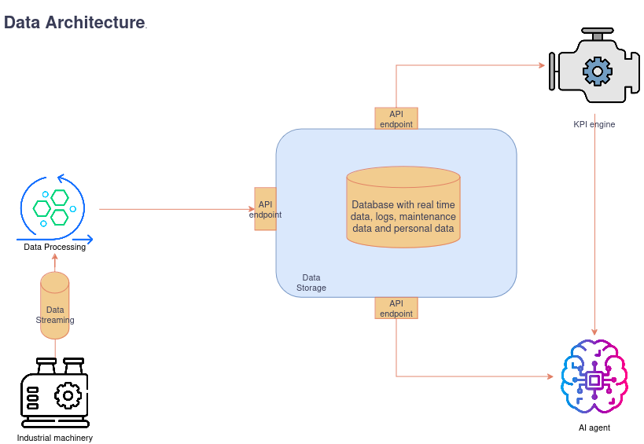
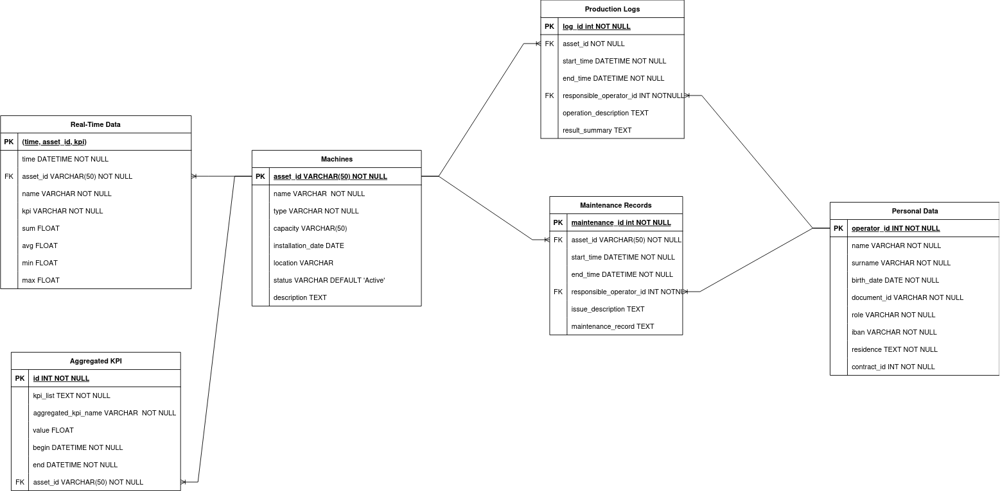

# Industry 5.0 Data Architecture for Smart Applications

This repository contains resources and tools to explore and implement a data architecture framework designed for Industry 5.0. It supports real-time data ingestion and processing for smart applications and can be used for educational purposes in a university course.

---

## 📁 Repository Contents

The repository contains the following files and directories:
```bash
📂 Project Root
├── 🛠️ backup.py
├── ⚙️ build_db.sh
├── 📤 export.sql
├── ✏️ filling.py
├── 🖼️ images
│   ├── 🖼️ architecture_diagram.png
│   └── 🖼️ er_schema.png
├── 📜 LICENSE
├── 📖 README.md
├── 📊 smart_app_data.csv
├── 🐋 dockerfile
└── 🧪 test_database.py
```
In order the contents are:
- **`backup.py`**
A Python script that backs up the database.
- **`build_db.sh`**
A shell script that creates a new database in the smart-database instance and imports the schema and initial data from the provided SQL file.
- **`export.sql`**
A PostgreSQL database dump. This contains the schema and initial data required for the project. It can be imported into the smart-database instance using the `build_db.sh` script.
- **`filling.py`**
A Python script that populates the database using data from the provided CSV file.
- **`smart_app_data.csv`**
   A CSV file containing real-time data used to fill the database for testing and demonstration purposes.
- **`images`**
   A directory containing images used in the README file.
- **`LICENSE`**
   A standard MIT license file.
- **`README.md`**
   A detailed README file containing information about the project, setup instructions, and other relevant details.
- **`dockerfile`**
   A Dockerfile that can be used to build a custom Docker image for the project.
- **`test_database.py`**
   A Python script that contains unit tests for the database functions (see the Testing section for more details).
---
## 📜 Introduction
### Industry 5.0 Data Architecture for Smart Applications

This project aims to provide a data architecture framework for Industry 5.0 applications. 
This repo is part of a larger project for the Smart Applications course at the University of Pisa.
This architecture is made by using a customised version of `PostgreSQL` called `TimescaleDB` which is an open-source time-series database optimized for fast ingest and complex queries and `pgvector` which is a PostgreSQL extension that provides support for vector similarity search and indexing.
The architecture supports real-time data ingestion and processing for smart applications and can be used for educational purposes in a university course. 
---
## 🚀 Getting Started

### Prerequisites

- [`Docker`](https://www.docker.com/) should be installed on your machine.
- [`Git`](https://git-scm.com/) should be installed on your machine.
- [`Python`](https://www.python.org/) should be installed on your machine.
- [`pytest`](https://docs.pytest.org/en/stable/) is used for testing the database functions.


### 1. Clone the Repository

Clone this repository to your local machine using the following command:

```bash
git clone https://github.com/Kreative-Performative-Individuals/smart-industrial-database
```

This will create a new directory named `smart-industrial-database` in your current working directory.

### 2. Build the Docker Image

Navigate to the cloned repository and build the Docker image using the following command:

```bash
docker build -t smart-database .
```

This will build a new Docker image named `smart-database` based on the provided Dockerfile.
You can check the list of Docker images on your machine using the following command:

```bash
docker images
```

#### 3. Run the smart-database Docker Container

1. Open your terminal or command prompt inside the cloned repository.
2. Run the following command to start the smart-database Docker container:
   ```bash
   $ docker run -itd -e POSTGRES_USER=postgres -e POSTGRES_PASSWORD=password -p 5432:5432 -v ./data:/var/lib/postgresql/data --name smart-database-container smart-database
   ```
This command will start a new Docker container named `smart-database-container` with the required environment variables and port mappings. From now on, you can use this container to interact with the smart-database instance. 
You can check the list of running Docker containers using the following command:
```bash
docker ps
```
If you remove the container, all the data will be stored in the `data` directory in the project root, so you can easily recreate the container with the same data by running the same command.
3. Run the following commands to prepare the database:

```bash
   chmod +x build_db.sh
```

```bash
   ./build_db.sh smart-database-container export.sql KPI_Database
```

This will create a new database named `KPI_Database` in the `smart-database-container` instance and import the schema and initial data from the `export.sql` file.

### Using pgAdmin

`pgAdmin` is a popular open-source administration and development platform for PostgreSQL. You can use pgAdmin to interact with the smart-database instance running in the Docker container. Follow the steps below to set up pgAdmin and connect it to the smart-database instance:

### 1. Install pgAdmin on Docker

Run the following command to install pgAdmin on Docker:

```bash
docker pull dpage/pgadmin4:latest
```

### 2. Run the pgAdmin Docker Container

Run the following command to start the pgAdmin Docker container:

```bash
$ docker run --name pgadmin-postgres -p 5051:80 -e "PGADMIN_DEFAULT_EMAIL=admin@admin.com" -e "PGADMIN_DEFAULT_PASSWORD=password" -d dpage/pgadmin4
```

### 3. Access pgAdmin

Open your web browser and navigate to `http://localhost:5051`. You will be prompted to log in with the default credentials. Use the following credentials to log in:

- Email: `admin@admin.com`
- Password: `password`

After logging in, you can add a new server connection to the smart-database instance running in the Docker container. Use the following connection details:

- Hostname/address: `172.17.0.2`
- Port: `5432`
- Username: `postgres`
- Password: `password`

If the localhost does not work, you can use the IP address of the Docker container. To find the IP address, run the following command:

```bash
docker inspect -f '{{range .NetworkSettings.Networks}}{{.IPAddress}}{{end}}' <container_id_or_name>
```

Replace `<container_id_or_name>` with the ID or name of the Docker container running the smart-database instance.

---
## 🧪 Testing the Database
If you want to test the database, all you need to do is run the following command:

```bash
pytest test_database.py
```
If you want more details about the tests, you can run the following command:

```bash
pytest test_database.py -v
```
More details about `pytest` can be found by running the following command:

```bash
pytest --help
```
---

## Understanding the Architecture and E-R Schema of the Database
The following architecture Diagram shows the overall design of the Industry 5.0 data architecture, including real-time data flows and processing pipelines.



The following E-R Diagram Illustrates the relationships between entities in the database schema.



